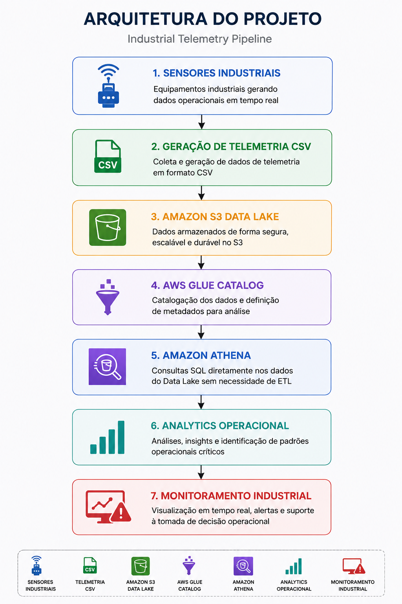
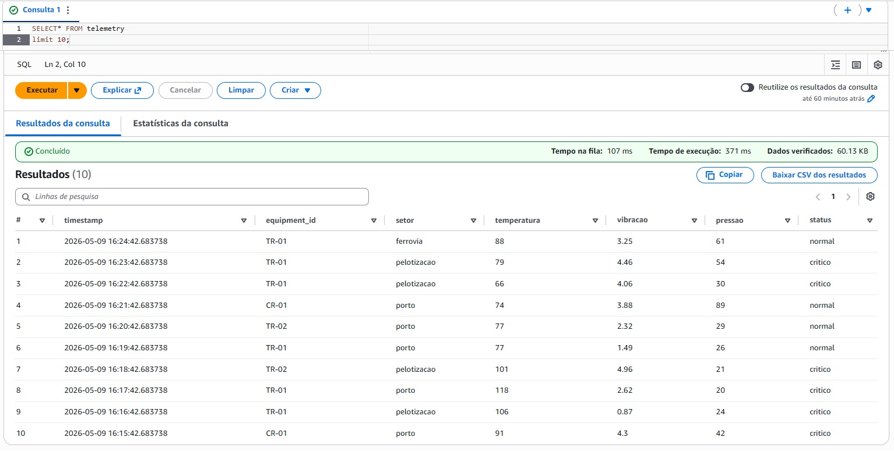
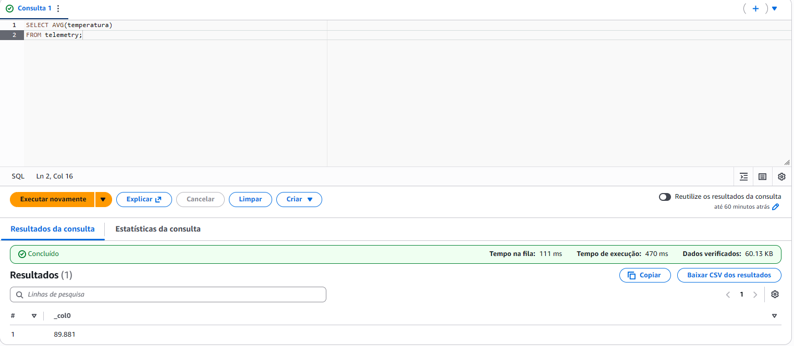
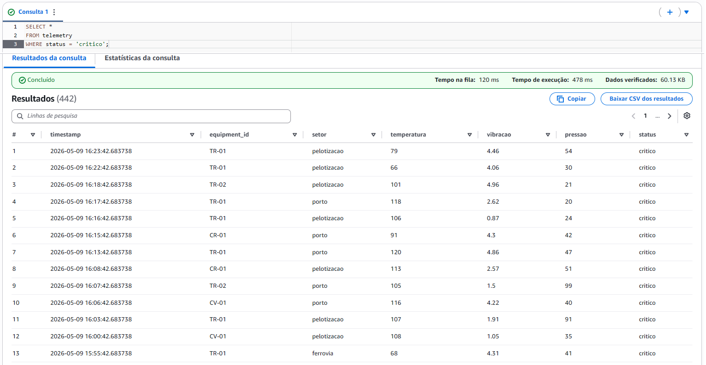

# Industrial Telemetry Pipeline


---

## Visão Geral

Projeto de engenharia de dados e analytics desenvolvido para simular um pipeline de telemetria industrial utilizando AWS e Python.

A solução representa um cenário de monitoramento operacional encontrado em ambientes industriais, permitindo coleta, armazenamento e análise de dados de sensores simulados.

O projeto demonstra conceitos aplicados de:

- Engenharia de Dados
- Data Lake
- Analytics Operacional
- Telemetria Industrial
- Cloud Computing
- Consultas analíticas em larga escala

---

## Problema de Negócio

Ambientes industriais geram milhares de registros operacionais diariamente através de sensores instalados em equipamentos críticos.

Este projeto demonstra como serviços AWS podem ser utilizados para:

- Centralizar dados operacionais
- Criar um Data Lake industrial
- Executar análises analíticas em escala
- Detectar comportamentos críticos
- Apoiar monitoramento operacional

---

## Arquitetura do Projeto



```text
Sensores Industriais
        ↓
Geração de Telemetria CSV
        ↓
Amazon S3 Data Lake
        ↓
AWS Glue Catalog
        ↓
Amazon Athena
        ↓
Analytics Operacional
        ↓
Monitoramento Industrial
```

---

## Tecnologias Utilizadas

- Python
- Pandas
- AWS S3
- AWS Glue
- Amazon Athena
- SQL
- Git & GitHub

---

## Funcionalidades

- Geração de dados simulados de telemetria
- Armazenamento em Data Lake
- Catálogo de dados com AWS Glue
- Consultas analíticas com Athena
- Identificação de registros críticos
- Simulação de monitoramento operacional

---

## Estrutura do Dataset

| Coluna | Descrição |
|---|---|
| equipment_id | Identificador do equipamento |
| setor | Área operacional |
| temperatura | Temperatura operacional |
| vibracao | Nível de vibração |
| pressao | Pressão operacional |
| status | Status do equipamento |

---

## Exemplos de Consultas

### Média de Temperatura

```sql
SELECT AVG(temperatura)
FROM telemetry;
```

---

### Equipamentos Críticos

```sql
SELECT *
FROM telemetry
WHERE temperatura > 100
OR vibracao > 4;
```

---

### Total de Equipamentos Críticos

```sql
SELECT COUNT(*)
FROM telemetry
WHERE status = 'critico';
```

---

## Estrutura do Projeto

```text
industrial-telemetry-pipeline/
│
├── dashboards/
│
├── data/
│   └── telemetry.csv
│
├── queries/
│   └── analytics_queries.sql
│
├── scripts/
│   └── generate_data.py
│
└── README.md
```

---

## Evidências do Projeto

### Consulta no Amazon Athena



---

### Média de Temperatura



---

### Análise de Equipamentos Críticos



---

## Como Executar o Projeto

### Clonar repositório

```bash
git clone https://github.com/SymonCosta/industrial-telemetry-pipeline.git
```

---

### Criar ambiente virtual

```bash
python -m venv .venv
```

---

### Ativar ambiente virtual

#### Windows

```bash
.venv\Scripts\activate
```

---

### Instalar dependências

```bash
pip install pandas
```

---

### Gerar dados simulados

```bash
python scripts/generate_data.py
```

---

## Fluxo Operacional

1. Python gera dados simulados de telemetria
2. Arquivo CSV é enviado para Amazon S3
3. AWS Glue cataloga os dados
4. Amazon Athena executa consultas SQL
5. Resultados são utilizados para análise operacional

---

## Próximos Passos

- Dashboard no Amazon QuickSight
- Integração em tempo real
- Streaming de telemetria
- Machine Learning para previsão de falhas
- Alertas automatizados
- Pipeline automatizado com AWS Lambda

---

## Autor

### Symon Costa

Analytics | Engenharia de Dados | AWS | Python | SQL

GitHub:
https://github.com/SymonCosta